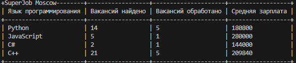

# Анализ зарплат
Программа анализирует вакансии программистов в Моске,
с сайтов HeadHunter и SuperJob, и собирает статистику в формате



## Переменные окружения
Часть настроек проекта берётся из переменных окружения. Чтобы их определить, создайте файл .env рядом с main.py и запишите туда данные в таком формате: ПЕРЕМЕННАЯ=значение.

#### Доступны следущие переменные:

- SJ_KEY — Secret key вашего приложения на SuperJob. [Получить можно тут](https://api.superjob.ru/info/)

## Установка и запуск
Для запуска сайта вам понадобится UV. Как установить вы найдете тут https://github.com/astral-sh/uv.

* Запустите программу
```
    uv run main.py
```